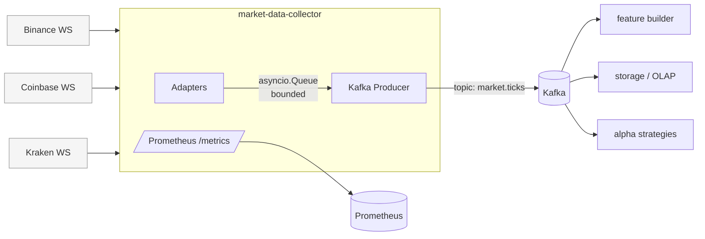

# market-data-collector

[](https://github.com/Pazificateur69/market-data-collector/actions/workflows/ci.yml)
[](https://www.python.org/)
[](LICENSE)

Async Python service that streams crypto trades from **Binance**, **Coinbase Advanced Trade**, and **Kraken** WebSocket feeds, normalizes them into a uniform `Tick` model, and publishes them to **Kafka** — with Prometheus metrics, bounded-queue backpressure, and exponential-backoff reconnection.

Designed as the ingestion layer of a small market-data microservice mesh:



## What it shows

- `asyncio` orchestration of multiple long-lived WebSocket streams
- The `websockets` library with ping/pong, timeouts, and clean reconnects
- An `aiokafka` producer with batching (`linger_ms`) and `lz4` compression
- **Bounded `asyncio.Queue`** between adapters and the producer → WS reads stay responsive even if Kafka stalls; queue overflow drops the oldest tick and increments a counter
- **Prometheus metrics** (`/metrics`): publish/drop/fail counters, queue depth, e2e latency histograms, WS connection gauge
- **Strict typing** (`mypy --strict`, Pydantic v2 models, `StrEnum`)
- Exponential backoff + jitter for resilient reconnection
- A small, well-isolated `ExchangeAdapter` interface — adding a fourth exchange is ~40 lines
- Multi-stage **Dockerfile**, non-root user, HTTP healthcheck, `docker compose` dev stack with Prometheus pre-wired
- CI: ruff, mypy, pytest, docker build (GitHub Actions, Python 3.11 + 3.12)

## Quick start (Docker Compose)

```bash
docker compose up --build
```

This brings up **Kafka**, the **collector**, and **Prometheus**. Then:

- **Watch the metrics:** http://localhost:9090 (try `rate(mdc_ticks_published_total[1m])`)
- **Raw exposition:** http://localhost:9100/metrics
- **Tail the topic:**
  ```bash
  docker compose exec kafka kafka-console-consumer.sh \
    --bootstrap-server localhost:9092 --topic market.ticks --from-beginning
  ```

Expected payload (one JSON line per trade):

```json
{
  "exchange": "binance",
  "symbol": "BTC-USDT",
  "price": "42000.50",
  "quantity": "0.0123",
  "side": "sell",
  "trade_id": "12345",
  "event_time": "2024-01-01T00:00:00+00:00",
  "received_at": "2024-01-01T00:00:00.123456+00:00"
}
```

## Local development

```bash
make install         # pip install -e ".[dev]"
make check           # ruff + mypy + pytest
make run             # requires a Kafka broker reachable at MDC_KAFKA_BOOTSTRAP_SERVERS
```

## Configuration

Every setting is an environment variable prefixed with `MDC_`. See [`.env.example`](.env.example) for the full list. Highlights:

| Variable | Default | Purpose |
|---|---|---|
| `MDC_BINANCE_SYMBOLS` | `btcusdt,ethusdt` | Comma-separated Binance symbols (lowercase) |
| `MDC_COINBASE_SYMBOLS` | `BTC-USD,ETH-USD` | Comma-separated Coinbase product IDs |
| `MDC_KRAKEN_SYMBOLS` | `XBT/USD,ETH/USD` | Comma-separated Kraken v2 symbols |
| `MDC_KAFKA_BOOTSTRAP_SERVERS` | `localhost:9092` | Kafka brokers |
| `MDC_KAFKA_TOPIC` | `market.ticks` | Destination topic |
| `MDC_QUEUE_MAX_SIZE` | `10000` | Bounded queue capacity (backpressure threshold) |
| `MDC_METRICS_PORT` | `9100` | Port for `/metrics` HTTP exposition |
| `MDC_BACKOFF_INITIAL_SECONDS` | `1.0` | Initial reconnect delay |
| `MDC_BACKOFF_MAX_SECONDS` | `60.0` | Cap on reconnect delay |

Disable an exchange by passing an empty list (`MDC_BINANCE_SYMBOLS=`).

## Metrics

Exposed at `:9100/metrics` (Prometheus format).

| Metric | Type | Labels | Purpose |
|---|---|---|---|
| `mdc_ticks_published_total` | counter | `exchange`, `symbol` | Successful publishes |
| `mdc_ticks_failed_total` | counter | `exchange` | Failed publishes |
| `mdc_ticks_dropped_total` | counter | `exchange` | Queue-overflow drops |
| `mdc_ws_connected` | gauge | `exchange` | 1 if WS up, 0 if down |
| `mdc_ws_reconnects_total` | counter | `exchange` | Reconnect attempts |
| `mdc_queue_depth` | gauge | – | Current in-memory queue size |
| `mdc_kafka_publish_latency_seconds` | histogram | – | Time per `send_and_wait` |
| `mdc_e2e_latency_seconds` | histogram | `exchange` | `event_time` → publish ack |

Useful starter queries:

```promql
# Throughput per exchange
sum by (exchange) (rate(mdc_ticks_published_total[1m]))

# p99 end-to-end latency per exchange
histogram_quantile(0.99, sum by (le, exchange) (rate(mdc_e2e_latency_seconds_bucket[5m])))

# Backpressure alarm
rate(mdc_ticks_dropped_total[5m]) > 0
```

## Project layout

```
src/market_data_collector/
├── __main__.py          # CLI entry point
├── collector.py         # orchestrator: adapters -> queue -> producer
├── config.py            # pydantic-settings
├── kafka_producer.py    # aiokafka wrapper + orjson serialization + latency tracking
├── metrics.py           # Prometheus registry + HTTP server
├── logging_config.py    # structlog JSON output
├── models.py            # Tick, Exchange, Side
└── exchanges/
    ├── base.py          # reconnection loop + parse hooks
    ├── binance.py       # combined-stream trade adapter
    ├── coinbase.py      # market_trades channel adapter
    └── kraken.py        # v2 trade channel adapter
```

## Adding a new exchange

Subclass `ExchangeAdapter` with three methods — `url()`, `subscribe_payload()`, `parse()` — register it in `Collector._build_adapters`, done. The reconnection, backoff, JSON parsing, queueing, Kafka publishing, and metrics are inherited.

## Operational notes

- **Partition key** = `"{exchange}:{symbol}"`. Trades for a given symbol on a given exchange land on the same partition → preserved ordering downstream.
- **At-least-once** delivery (`acks=1`, `enable_idempotence=False`). For a trading system you'd flip this to `acks=all` + idempotence; the default favors throughput for analytics.
- **Backpressure**: when the queue fills, the *oldest* tick is dropped and `mdc_ticks_dropped_total` increments. Newer ticks are more valuable to downstream consumers than stale ones.
- The Docker healthcheck hits `/metrics` — the metrics server is the cheapest reliable liveness signal.
- Graceful shutdown on SIGINT/SIGTERM: in-flight queue is flushed before the producer is stopped.

## License

MIT — see [LICENSE](LICENSE).
